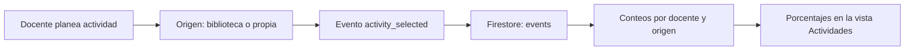

# BQ tipo 2: uso de actividades

**Responsable:** Samuel Charry  
**Pregunta:** ¿Qué porcentaje de las actividades planeadas sale de la biblioteca y qué porcentaje crea el docente?

## Cálculo

La unidad de análisis es una **actividad planeada**, no un docente. La vista muestra el historial del docente que inició sesión. El período actual es todo el historial disponible.

- `biblioteca = número de eventos activity_selected con source = library`
- `propias = número de eventos activity_selected con source = custom`
- `total = biblioteca + propias`
- `% biblioteca = biblioteca / total × 100`
- `% propias = propias / total × 100`

Cuando `total = 0`, la vista indica que aún no hay actividades planeadas y evita dividir por cero. Cada actividad planeada cuenta una vez; un docente puede usar ambas opciones.

## Datos y pipeline

Al planear una actividad, `ActivityCreator` registra el evento con `teacherId`, `source`, `name`, `platform` y `createdAt`. `AnalyticsService` también envía el evento a Firebase Analytics. La vista consulta Firestore para recuperar los conteos del docente actual. Las reglas de Firestore permiten leer únicamente sus eventos; el índice compuesto de `teacherId`, `name` y `source` soporta la consulta. `ActivitiesViewModel` calcula los porcentajes y `ActivitiesView` los presenta con los conteos.

Se usa un **Factory Method** para crear las dos clases de actividad. Así ambas siguen el mismo flujo de planeación y registro, mientras cada clase conserva sus propios datos. La analítica es descriptiva: permite comparar cómo se planifican las actividades, pero no demuestra por qué el docente eligió cada opción.

## Evidencia para la wiki

Incluye una captura de la vista después de planear una actividad de biblioteca y una propia. Debe mostrar `1` y `1`, total `2` y porcentajes `50 %` y `50 %`. Añade otra captura tras reiniciar la app para mostrar que el conteo se recupera de Firestore. Registra la fecha de la prueba, el usuario de prueba y el resultado. No publiques contraseñas ni tokens.

Esta vista responde la pregunta **por docente**. Si el curso pide un único porcentaje para todos los docentes, habrá que agregar una consulta agregada del sistema y dejar explícito ese cambio de alcance en la wiki. Tampoco se deben inventar porcentajes reales antes de recopilar eventos.
